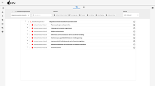
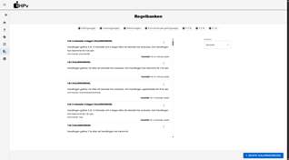
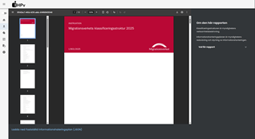
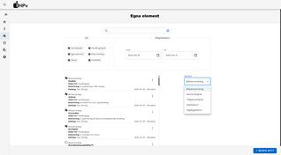

<center>

# Informationshanteringsplans-verktyget (IHP-v)

</center>

<p align="center">

</p>

## **IHP-verktyget (IHP-v)** används för att hantera det som behövs för att digitalisera informationshanteringsplanen. Den utgör grunden för informationsstyrningen av verksamsamhetsinformationen. IT-stödet är uppdelat i fyra huvudkomponenter:


### **Modellbyggaren**
[](./bilder/startsida.png)

#### Funktioner för klassificeringsstruktur, administration av strukturmodeller och koppling av informationshanteringsregler för att bygga upp informationshanteringsplanen.


### **Regelbank**
[](./bilder/gallringsregel.png)
#### Informationshanteringsregler (ex: gallringsregler, arkiveringsregler)


### **Informationsredovisning**
[](./bilder/rapportvy.png)
#### Innehåller funktioner för rapporter utifrån information i de olika komponenterna såsom klassificeringsstruktur, informationshanteringsplan och strukturmodeller.


### **Egna element**

#### Dynamisk möjlighet att utöka IHP.
[](./bilder/egnaelement.png)


## Byggt med


## Kom igång
Projektet är byggt i två delar med en backend i Java Spring Boot och en frontend i React och Typescript. Databasen är Postgresql. Byggs med Docker Compose. Backend återfinns i /backend, frontend i /frontend och databasfilerna körs i ordningen som dom ligger i /databas, ordningen är viktig. Databasen kommer förkonfigurerad med exempeldata, en av varje undertyp för att visa hur grundstrukturen ser ut, allt sparat i en klassificieringsstruktur sparad som utkast.

### Förutsättningar


<details><summary><b>Installationsinstruktioner</b></summary>

1. Se till att Docker Compose är installerat (https://docs.docker.com/compose/install/)

2. Klona ner repot:

    ```sh
    git clone https://github.com/migrationsverket/ihpv.git
    ```

3. Bygg med hjälp av Docker Compose:

   ```sh
   docker compose up
   ```

4. Öppna webapplikationen:

   ```js
   http://localhost:8081/
   ```

5. Vill du titta i databasen genom pgadmin4 öppna:

   ```sh
   http://localhost:8082/
   ```

</details>

## License

Distributed under the CC0 1.0 Universal License. See <a href="LICENSE.txt">`LICENSE`</a> for more information.


