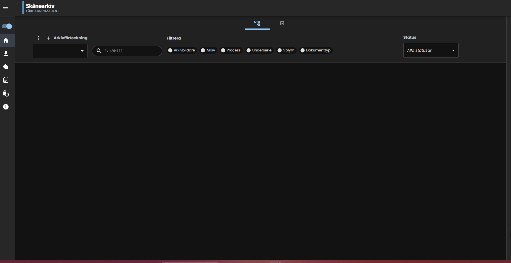

<p align="center">
  
</p>

# Förteckningsklient för Skånearkiv

Webbaserat verktyg för att upprätta, förvalta och fastställa **arkivförteckningar** enligt svensk arkivredovisningsstandard. Verktyget är avsett för Skånearkiv.

Baserat på Migrationsverkets öppna källkod [IHPv](https://github.com/migrationsverket/IHPv), omarbetad och utökad för arkivredovisning.



---

## Strukturmodell

Förteckningsklienten följer den svenska arkivredovisningsstrukturen:

```
Arkivförteckning
└── Arkivbildare          (organisation, orgNummer, arkivansvarig, verksamhetsperiod)
    └── Arkiv             (arkivIdBeteckning, förvaringsplats, handlingar från/till)
        └── Serie         (seriesignum, serierubrik, förvaringsplats, omfång)
            └── Underserie (underseriesignum, innehåll, handlingar fr.o.m./t.o.m.)
                └── Volym (volymnum, format, tillgänglighet)
```

Seriesignum (t.ex. `F1`, `A2:a`) visas som märke direkt i trädvyn och kortvyn.

---

## Funktioner

### Förteckningsbyggaren
Bygg arkivförteckningen i ett hierarkiskt träd. Varje nodnivå har egna metadatafält anpassade efter arkivredovisningsstandard. Dra och släpp för att omstrukturera.

### Gallrings- och bevaranderegler
Koppla regler till noder via en stegvis guide. Regelsteget **Arkivmetadata** samlar:
- **RA-FS referens** – hänvisning till Riksarkivets författningssamling
- **Gallringsgrund** – rättslig grund för gallringen
- **Åtgärd** – `gallras` eller `bevaras`

### Fastställning
Arkivförteckningen följer ett statusflöde: **Utkast → Fastställd → Utgått**. Fastställande kräver rollen ARKIVANSVARIG.

### Rapport och export
Högerklicka på en Arkivförteckning → **Rapport** för att granska hela förteckningen med arkivkorrekta prefix per nodnivå. Ladda ned som `FaststalldArkivforteckning.json`.

### Import av arkivförteckning
Högerklicka på en Arkivförteckning → **Importera** för att läsa in en tidigare exporterad JSON-fil. Alla noder återskapas med korrekta föräldra–barn-relationer. Kräver rollen ARKIVANSVARIG eller ARKIVARIE.

### Visual Arkiv ETL-pipeline
Migrera data från ett befintligt Visual Arkiv-system i fyra steg via REST-API:

| Steg | Endpoint | Beskrivning |
|---|---|---|
| 1 | `POST /inspect` | Inspektera källschema — tabeller och kolumner |
| 2 | `POST /prepare` | Extrahera och transformera utan att skriva; returnerar dry-run-rapport + `confirmationToken` |
| 3 | `POST /execute?confirmationToken=` | Verklig import; kräver token från steg 2 |
| 4 | `GET /report/{batchId}` | Hämta rapport för valfri tidigare import |

Aktiveras med `visual.arkiv.datasource.enabled=true`. Varje import är **idempotent** — om samma rad importeras igen räknas den som duplikat och skippas.

#### Importprovenans
Alla importerade noder märks med `legacy_id`, `legacy_source_system`, `legacy_table` och `imported_at`. Dessa visas som ett infällbart **Importmetadata**-kort i nodformuläret.

### Händelselogg
Spåra alla ändringar i förteckningen med tidsstämpel och användare.

---

## Roller

| Roll | Behörigheter |
|---|---|
| ARKIVANSVARIG | administrera, visa, faststalla, importera |
| ARKIVARIE | administrera, visa, importera |
| LASARE | visa |

I lokal/utvecklingsläge (`environment=local`) tillåts alla åtgärder utan IAM (mock-läge). Standardvärdet är `production` — sätt `ENVIRONMENT=local` explicit i din lokala miljö.

---

## Produktionsdriftsättning

Två driftsättningsvägar finns — välj den som passar din infrastruktur.

### Docker Compose (rekommenderat)

```sh
cp .env.production.example .env.production
# Redigera .env.production och sätt starka lösenord
docker compose -f docker-compose.prod.yml --env-file .env.production up -d
```

Applikationen startar på port 80. Sätt `LISTEN_HOST=127.0.0.1` och lägg en nginx i front för TLS.

### Standalone — Java-jar + Nginx (Ubuntu/Debian)

```sh
# Bygg artefakter
mvn -f backend/pom.xml package -DskipTests
cp backend/target/spring-boot-app-*-exec.jar app.jar
cd frontend && npm ci && npm run build && cd ..

# Installera (kräver root/sudo)
sudo bash scripts/install-linux.sh
```

Skriptet installerar Java 17, PostgreSQL och Nginx, skapar systemd-tjänst och nginx-konfiguration.

### Windows Server

```powershell
# Kör som administratör
.\scripts\install-windows.ps1
```

Se [docs/production-deployment.md](docs/production-deployment.md) för fullständiga instruktioner, säkerhetskopiering och uppgradering.

---

## Kom igång

### Förutsättningar


<details><summary><b>Installation – ny installation</b></summary>

1. Klona repot:
   ```sh
   git clone https://github.com/hypergeek-dev/arkivforteckningsklient.git
   cd arkivforteckningsklient
   ```

2. Skapa en `.env`-fil med hemligheter (kopiera från mallen):
   ```sh
   cp .env.example .env
   # Redigera .env och sätt egna lösenord
   ```

3. Starta med Docker Compose:
   ```sh
   docker compose up -d
   ```

   Databasen skapas och migreras automatiskt av **Flyway** när backend startar.
   Inga manuella `psql`-kommandon behövs.

4. Öppna applikationen:
   ```
   http://localhost:8081/
   ```

5. Databas via pgAdmin:
   ```
   http://localhost:8082/
   ```

> **Standardinloggning (ändra omedelbart):** `admin` / `changeme`
>
> Applikationen vägrar starta i icke-lokal miljö om `admin`-kontots lösenord fortfarande är `changeme`. Byt lösenord direkt efter första installation.
>
> Swagger UI är avstängt som standard. Aktivera med `SWAGGER_ENABLED=true` i `.env` vid behov (rekommenderas inte i produktion).

</details>

<details><summary><b>Uppgradering – befintlig installation</b></summary>

Flyway detekterar automatiskt vilka migrationer som saknas och kör enbart dem.
Det krävs inga manuella SQL-kommandon vid uppgradering.

Om databasen är äldre än Flyway-versionen (initierades med `psql`-skripten):
```sh
# Baslinjea Flyway mot den befintliga databasen (körs en gång)
docker compose exec backend java -jar app.jar \
  -Dflyway.baselineOnMigrate=true -Dflyway.baselineVersion=1
```

Driftsätt sedan de nya Docker-imagen:
```sh
docker compose build --no-cache backend frontend
docker compose up -d --no-deps backend frontend
```

</details>

---

## Databas­migrationer (Flyway V1–V5)

| Version | Innehåll |
|---|---|
| V1 | Bastabeller: csnode, oanode, pgnode, processnode, issuenode, documentnode |
| V2 | Arkivredovisningsfält: seriesignum, underseriesignum, innehall, handlingar_fran/till |
| V3 | Autentisering: ihp_users, ihp_authorities med standardanvändare admin/changeme |
| V4 | Importprovenans: legacy_id, legacy_source_system, legacy_table, legacy_parent_id, imported_at, import_batch_id + partiella unika index |
| V5 | Importbatch-tabell: import_batch med confirmation_token för ETL-pipeline |

---

## Byggt med


Backend: Java 17, Spring Boot 3.5, Spring Data JPA, Hibernate, Lombok.  
Frontend: React 18, TypeScript, Redux Toolkit + Redux-Saga, MUI, Webpack.  
Databas: PostgreSQL med Flyway-hanterade versionsmigrationer (V1–V5).  
Säkerhet: JDBC-baserad Spring Security med rollmodell (ARKIVANSVARIG / ARKIVARIE / LASARE), cookie-baserad CSRF-skydd.  
Tester: Testcontainers integration tests (Flyway-migrationer, importidempotens, rollbehörigheter).

---

## Ursprung och licens

Detta projekt är en fork av [migrationsverket/IHPv](https://github.com/migrationsverket/IHPv), publicerat under **CC0 1.0 Universal** (ingen upphovsrätt förbehålls).

Förändringar i denna fork: terminologiomskrivning till arkivredovisning, arkivspecifika metadatafält (V2), seriesignum-visning, RA-FS-stöd i regelbank, rapport- och importfunktion, Flyway-versionsmigrationer (V1–V5), JDBC-baserad Spring Security med rollmodell (V3), importprovenanskolumner och partiella unika index (V4), Visual Arkiv ETL-pipeline med idempotent batchimport (V5), importmetadatakort i alla nodformulär.

Se [LICENSE.txt](LICENSE.txt) för fullständig licenstext.
